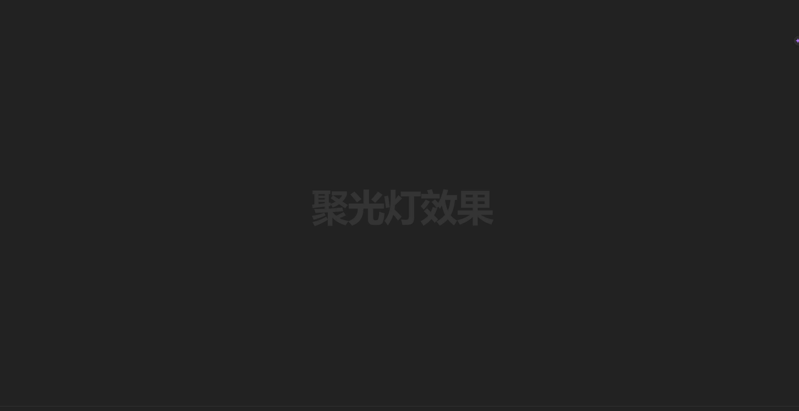

<!-- @format -->

# 聚光灯效果

## 一、基本架构

### 创建一个 html 框架

```html
<!DOCTYPE html>
<html lang="en">
  <head>
    <meta charset="UTF-8" />
    <meta name="viewport" content="width=device-width, initial-scale=1.0" />
    <title>Document</title>
  </head>
  <body></body>
</html>
```

###　创建一个 css 文件，名为`index.css`

在 html 中这样引入他：

```diff
<!DOCTYPE html>
<html lang="en">
<head>
    <meta charset="UTF-8">
    <meta name="viewport" content="width=device-width, initial-scale=1.0">
    <title>Document</title>
+	<link rel="stylesheet" href="index.css"/>
</head>
<body>

</body>
</html>
```

## 二、开始编写 CSS

首先，先把 body 内容写好

```html
<h1>聚光灯效果</h1>
```

只需要一个 h1 就可以

接着开始 CSS 的部分。

```css
html {
  font-size: 15px;
  /* 设置默认字体大小15px */
}

body {
  background: #333;
  /* body的背景颜色为#333 */
  display: flex;
  /* flex布局 */
  justify-context: center;
  align-items: center;
  /* 上下左右居中 */
  min-height: 100vh;
  /* 最低高度100vh */
}

h1 {
  color: #333;
  /* 字体颜色#333 */
  margin: 0;
  padding: 0;
  /* 内外边距设置为0 */
  font-size: 8rem;
  /* 字体大小为8rem */
  letter-spacing: -0.3rem;
  /* 字间距为-0.3rem */
}
```



之后，在`index.css`中加入`h1::after`

```css
h1::after {
  content: '聚光灯效果';
  color: yellow;
  position: absolute;
  top: 0;
  left: 0;
}
```


要想重叠，就要在`h1`加入`position: relative`

```diff
h1 {
  color: #333;
  /* 字体颜色#333 */
  margin: 0;
  padding: 0;
  /* 内外边距设置为0 */
  font-size: 8rem;
  /* 字体大小为8rem */
  letter-spacing: -0.3rem;
  /* 字间距为-0.3rem */
+ position: relative;
}
```

接下来就是套用遮罩，我们会用到 `clip-path` 属性
> 由于`clip-path`是一个预览阶段的属性，可能还需要添加前缀`-webkit-`

```css
h1::after {
  content: attr(data-spotlight);
  color: transparent;
  position: absolute;
  top: 0;
  left: 0;
  -webkit-clip-path: ellipse(100px 100px at 0% 50%);
  /* 设置遮罩形状为椭圆 */
  clip-path: ellipse(100px 100px at 0% 50%);
  /* 设置遮罩形状为椭圆 */
}
```

注意带前缀的要放在前面
